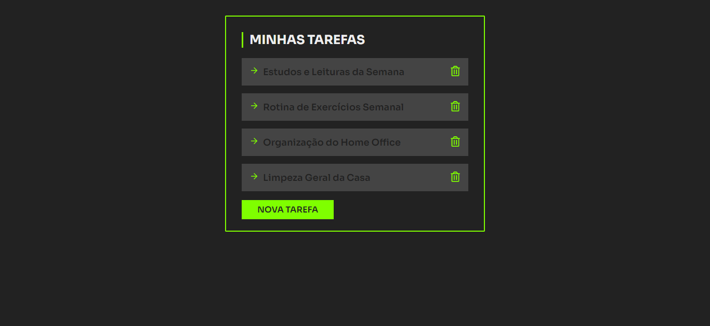

<h1 align="center">
  Lista de Tarefas
</h1>

  

## Projeto - Lista de Tarefas

Este projeto oferece aos usuários uma experiência agradável ao permitir a organização e controle de suas tarefas. Com um design atrativo e estrutura responsiva, garante funcionalidade em diferentes dispositivos.

Tecnologias Utilizadas:
* [HTML (Linguagem de marcação):](https://www.w3schools.com/html/html_intro.asp) Utilizado para estruturar e definir o conteúdo da página, incluindo cabeçalhos, parágrafos, listas e imagens.
* [CSS (Folha de estilos em cascata):](https://www.w3schools.com/css/css_intro.asp) Utilizado para estilizar os elementos da página, definindo cores, tamanhos, fontes e layout, proporcionando uma aparência visualmente atraente.
* [JavaScript:](https://developer.mozilla.org/pt-BR/docs/Web/JavaScript) Utilizado para adicionar interatividade à página, permitindo que o usuário selecione personagens e exiba informações dinamicamente.
* [React:](https://react.dev/) Utilizado para construir interfaces de usuário interativas e dinâmicas em aplicações web.
* [TinyJPG](https://tinyjpg.com/) e [TinyPNG:](https://tinypng.com/) O site utilizado é uma ferramenta online que comprime imagens JPEG e PNG sem perder muita qualidade. Ele reduz o tamanho dos arquivos de imagem usando algoritmos eficientes de compressão.
* [Google Fonts:](https://fonts.google.com/specimen/Sora) Utilizado para acessar e aplicar fontes personalizadas aos textos da página, melhorando a estilização e a legibilidade.

Créditos:
* Criado com base do Canal no YouTube | [Felipe Rocha • dicasparadevs](https://www.youtube.com/@dicasparadevs)

Implantação do Projeto no Vercel: [Explore o projeto clicando aqui.](https://lista-tarefas-jcddsj01.vercel.app/)
